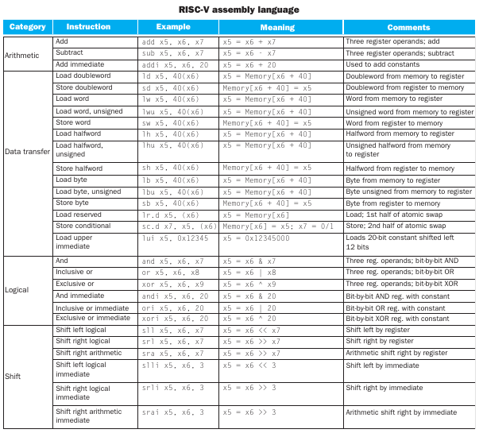
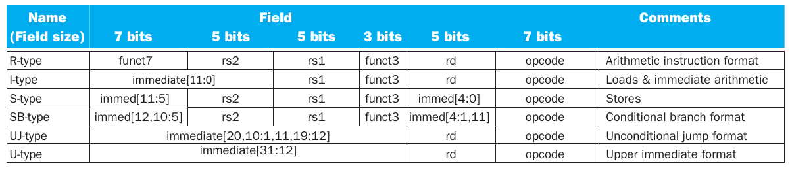
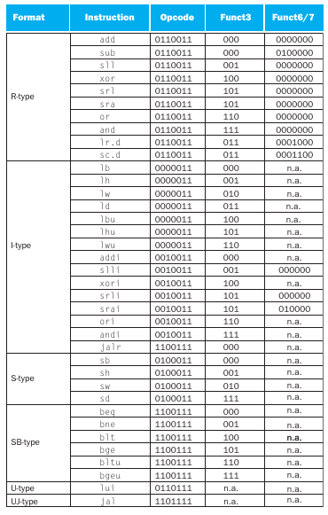

## Creando un backend con LLVM para una arquitectura RISC-V 

[basado en cpu0 de Chen Chung-Shu](http://jonathan2251.github.io/lbd/about.html)

<p align="justify"> LLVM es una es una infraestructura para desarrollar compiladores, diseñada para optimizar el tiempo de enlazado, de compilación y de ejecución de cualquier lenguaje de programación definido por el usuario. </p>

<p align="justify"> Cuenta con una parte de frontend dónde se ingresa el código fuente, una segunda etapa de optimización y una final de backend en la que genera código máquina como se observa en la figura 1. </p>


<p align="center"> Figura 1. Fases generales del compilador </p>

<p align="justify"> Debido a que el código de entrada puede ser cualquiera, es complejo el manejo de N posibles entradas. En este caso nos vamos a enfocar en el backend y el modelo intermedio (IR) que genera LLVM para la creación del código máquina deseado.</p>

### RISC-V

<p align="justify"> Primero se debe definir detalladamente la arquitectura del procesador a usar, en nuestro caso RISC-V se toma como base. En la figura 2 se describen algunas instrucciones en ensamblador de RISC-V.</p>



<p align="center">Figura 2. Lenguaje ensamblador de RISC-V </p>

<p align="justify"> En la figura 3 se observan los principales formatos de instrucciones junto a su codificación. Es importante tener bien definidos los bits que le corresponden a cada parte de las instrucciones, más adelante se va a detallar cómo se agregan, modifican y eliminan los formatos de instrucciones en los archivos de configuración de LLVM. </p>



<p align="center">Figura 3. RISC-V instruction formats [Computer Organization and Design T H E  H A R D W A R E / S O F T W A R E  I N T E R FA C E RISC-V Edition] </p>

<p align="justify"> En la figura 4 se observa la codificación de las instrucciones junto a los formatos descritos anteriormente, esta instrucciones al igual que en los formatos se agregan a los archivos de configuración de LLVM para su uso. </p>



<p align="center">Figura 4. RISC-V instruction encoding [Computer Organization and Design T H E  H A R D W A R E / S O F T W A R E  I N T E R FA C E RISC-V Edition] </p>

<p align="justify"> RISC-V cuenta con 32 registros, los registros se deben describir en los archivos de configuración  de LLVM. </p>


### LLVM

#### Representación intermedia de LLVM (IR)

<p align="justify"> Uno de los aspecto más importante de su diseño del compilador es la representación intermedia de LLVM (IR), es la forma que utiliza para representar el código en el compilador. LLVM IR está diseñado para alojar análisis y transformaciones de nivel medio, se explica el [capítulo de optimización de un compilador](http://releases.llvm.org/7.0.0/docs/CodeGenerator.html). Fue diseñado con muchos objetivos específicos, incluyendo el soporte de optimizaciones de tiempo de ejecución, optimizaciones de funciones, análisis de todo el programa y transformaciones agresivas de reestructuración, etc. Sin embargo, el aspecto más importante de esto es que se define como un lenguaje de primera clase con semántica bien definida.  </p>

Un ejemplo simple de un archivo .ll :

```c
define i32 @add1(i32 %a, i32 %b) {
entry:
  %tmp1 = add i32 %a, %b
  ret i32 %tmp1
}
define i32 @add2(i32 %a, i32 %b) {
entry:
  %tmp1 = icmp eq i32 %a, 0
  br i1 %tmp1, label %done, label %recurse
recurse:
  %tmp2 = sub i32 %a, 1
  %tmp3 = add i32 %b, 1
  %tmp4 = call i32 @add2(i32 %tmp2, i32 %tmp3)
  ret i32 %tmp4
done:
  ret i32 %b
}
```

El código LLVM IR corresponde al código C siguiente:

```c
unsigned add1(unsigned a, unsigned b) {
  return a+b;
}
// Perhaps not the most efficient way to add two numbers.
unsigned add2(unsigned a, unsigned b) {
  if (a == 0) return b;
  return add2(a-1, b+1);
}
```

que proporciona dos formas diferentes de agregar números enteros.

<p align="justify"> Como se puede ver en este ejemplo, LLVM IR es un conjunto de instrucciones similar a RISC de bajo nivel. De la misma manera que en un conjunto de instrucciones RISC real, admite secuencias lineales de instrucciones simples como add, subtract, compare y branch. LLVM IR admite etiquetas, en general, parece una forma de lenguaje ensamblador.
</p>

<p align="justify"> A diferencia de la mayoría de los conjuntos de instrucciones RISC, LLVM está fuertemente tipado con un sistema de tipo simple (por ejemplo, i32 es un entero de 32 bits, i32** es un puntero a un entero de 32 bits) y algunos detalles de la máquina se abstraen. Por ejemplo, la convención de llamada se abstrae a través de instrucciones de llamada y retención, con argumentos explícitos. Otra diferencia significativa del código de máquina, es que LLVM IR no usa un conjunto fijo de registros con nombre, usa un conjunto infinito de nombres temporales con un carácter %. </p>

<p align="justify"> Más allá de ser implementado como un lenguaje, LLVM IR se define en realidad en tres formas isomórficas: el formato textual anterior, una estructura de datos en memoria inspeccionada y modificada por las optimizaciones en sí mismas, y un formato binario en disco. </p>

<p align="justify"> La representación intermedia de un compilador puede ser un "mundo perfecto" para el optimizador del compilador, a diferencia del frontend y el backend del compilador, el optimizador no está limitado por un idioma de origen específico o una máquina de destino específica . Tiene que hacerlo de la mejor manera para ambos casos, debe estar diseñado para que sea fácil de generar para el frontend y lo suficientemente expresivo como para permitir que se realicen importantes optimizaciones para objetivos reales. </p>

