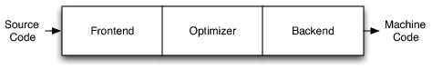

## Creando un backend con LLVM para una arquitectura RISC-V 

[basado en cpu0 de Chen Chung-Shu](https://jonathan2251.github.io/lbd/about.html) y [documentación de LLVM](https://www.llvm.org/docs/WritingAnLLVMBackend.html)

<p align="justify"> LLVM es una es una infraestructura para desarrollar compiladores, diseñada para optimizar el tiempo de enlazado, de compilación y de ejecución de cualquier lenguaje de programación definido por el usuario. </p>

<p align="justify"> Cuenta con una parte de frontend dónde se ingresa el código fuente, una segunda etapa de optimización y una final de backend en la que genera código máquina como se observa en la figura 1. </p>

<p align="center">  </p>

<p align="center"> Figura 1. Fases generales del compilador </p>

<p align="justify"> Debido a que el código de entrada puede ser cualquiera, es complejo el manejo de N posibles entradas. En este caso nos vamos a enfocar en el backend y el modelo intermedio (IR) que genera LLVM para la creación del código máquina deseado.</p>

### RISC-V

<p align="justify"> Primero se debe definir detalladamente la arquitectura del procesador a usar, en nuestro caso RISC-V se toma como base. En la figura 2 se describen algunas instrucciones en ensamblador de RISC-V.</p>

<p align="center">  </p>

<p align="center">Figura 2. Lenguaje ensamblador de RISC-V [Tomada del libro: "Computer Organization and Design The Hardware/Software Interface RISC-V Edition"]</p>

<p align="justify"> En la figura 3 se observan los principales formatos de instrucciones junto a su codificación. Es importante tener bien definidos los bits que le corresponden a cada parte de las instrucciones, más adelante se va a detallar cómo se agregan, modifican y eliminan los formatos de instrucciones en los archivos de configuración de LLVM. </p>

<p align="center">  </p>

<p align="center">Figura 3. RISC-V instruction formats [Tomada del libro: "Computer Organization and Design The Hardware/Software Interface RISC-V Edition"] </p>

<p align="justify"> En la figura 4 se observa la codificación de las instrucciones junto a los formatos descritos anteriormente, esta instrucciones al igual que en los formatos se agregan a los archivos de configuración de LLVM para su uso. </p>

<p align="center">  </p>

<p align="center">Figura 4. RISC-V instruction encoding [Tomada del libro: "Computer Organization and Design The Hardware/Software Interface RISC-V Edition"] </p>

<p align="justify"> RISC-V cuenta con 32 registros, los registros se deben describir en los archivos de configuración  de LLVM. </p>


### LLVM

<p align="justify"> Se va a trabajar sobre un compilador basado en <a href="https://github.com/riscv/riscv-llvm.git"> RISC-V de LLVM</a> , esto facilitará el trabajo de agregar casi 5000 líneas de código y se explicará cada uno de los archivos que se deben modificar para agregar o quitar destinos, modificar el ISA y la generación de código.</p>

<p align="justify">Para la compilación se hace uso de cmake, anteriormente se usaba makefiles pero se le dejó de dar soporte y ahora LLVM usa cmake. </p>

#### Representación intermedia de LLVM (IR)

<p align="justify"> Uno de los aspecto más importante de su diseño del compilador es la representación intermedia de LLVM (IR), es la forma que utiliza para representar el código en el compilador. LLVM IR está diseñado para alojar análisis y transformaciones de nivel medio, se explica el <a href="https://llvm.org/docs/LangRef.html">capítulo de optimización de un compilador</a>. Fue diseñado con muchos objetivos específicos, incluyendo el soporte de optimizaciones de tiempo de ejecución, optimizaciones de funciones, análisis de todo el programa y transformaciones agresivas de reestructuración, etc. Sin embargo, el aspecto más importante de esto es que se define como un lenguaje de primera clase con semántica bien definida.  </p>

Un ejemplo simple de un archivo .ll :

```pseudocode
define i32 @add1(i32 %a, i32 %b) {
entry:
  %tmp1 = add i32 %a, %b
  ret i32 %tmp1
}
define i32 @add2(i32 %a, i32 %b) {
entry:
  %tmp1 = icmp eq i32 %a, 0
  br i1 %tmp1, label %done, label %recurse
recurse:
  %tmp2 = sub i32 %a, 1
  %tmp3 = add i32 %b, 1
  %tmp4 = call i32 @add2(i32 %tmp2, i32 %tmp3)
  ret i32 %tmp4
done:
  ret i32 %b
}
```

El código LLVM IR corresponde al código C siguiente:

```c
unsigned add1(unsigned a, unsigned b) {
  return a+b;
}
// Perhaps not the most efficient way to add two numbers.
unsigned add2(unsigned a, unsigned b) {
  if (a == 0) return b;
  return add2(a-1, b+1);
}
```

que proporciona dos formas diferentes de agregar números enteros.

<p align="justify"> Como se puede ver en este ejemplo, LLVM IR es un conjunto de instrucciones similar a RISC de bajo nivel. De la misma manera que en un conjunto de instrucciones RISC real, admite secuencias lineales de instrucciones simples como add, subtract, compare y branch. LLVM IR admite etiquetas, en general, parece una forma de lenguaje ensamblador.
</p>

<p align="justify"> A diferencia de la mayoría de los conjuntos de instrucciones RISC, LLVM está fuertemente tipado con un sistema de tipo simple (por ejemplo, i32 es un entero de 32 bits, i32** es un puntero a un entero de 32 bits) y algunos detalles de la máquina se abstraen. Por ejemplo, la convención de llamada se abstrae a través de instrucciones de llamada y retención, con argumentos explícitos. Otra diferencia significativa del código de máquina, es que LLVM IR no usa un conjunto fijo de registros con nombre, usa un conjunto infinito de nombres temporales con un carácter %. </p>

<p align="justify"> Más allá de ser implementado como un lenguaje, LLVM IR se define en realidad en tres formas isomórficas: el formato textual anterior, una estructura de datos en memoria inspeccionada y modificada por las optimizaciones en sí mismas, y un formato binario en disco. </p>

<p align="justify"> La representación intermedia de un compilador puede ser un "mundo perfecto" para el optimizador del compilador, a diferencia del frontend y el backend del compilador, el optimizador no está limitado por un idioma de origen específico o una máquina de destino específica . Tiene que hacerlo de la mejor manera para ambos casos, debe estar diseñado para que sea fácil de generar para el frontend y lo suficientemente expresivo como para permitir que se realicen importantes optimizaciones para objetivos reales. </p>


#### Archivos de descripción de destino de LLVM: .td

<p align="justify"> En los archivos *.td de LLVM es dónde se describe el ISA y son procesados por la herramienta tblgen que genera *.inc . Para cada archivo .td se tienen .h y .cpp con código en C++ para el manejo de las distintas descripciones de la arquitectura.</p>

<p align="justify"> El idioma utilizado en los archivos .td es un lenguaje de descripción de destino (hardware) que permite a los ingenieros de compilación backend de llvm definir la transformación para LLVM IR y las instrucciones de la máquina de sus CPU. En la interfaz, las herramientas de desarrollo del compilador proporcionan el "parser generator" para el desarrollo del compilador; en el backend, proporcionan el generador de código de máquina para el desarrollo, tal como se muestra en la figura 5.</p>

<p align="center">  </p>

<p align="center"> Figura 5. Descripción de la generación de código máquina en LLVM </p>

<p align="justify"> Los archivos que se deben modificar y/o crear .td son varios, se explicará cada uno de ellos con detalle.</p>

La estructura destino está en target.td, que para este caso es **RISCV.td**

<p align="justify"> Este archivo está en el directorio lib/target y ahí es donde se encuentran todos los destinos a usar por el backend como x86, ARM, MIPS, PowerPC, etc. La carpeta lib está sobre el directorio en el cuál se va a trabajar, no es /lib del sistema operativo. </p>

Dentro de .../target/ se encuentran varios archivos cmake y de construcción que usa LLVM para registrar un nuevo destino, específicamente en el archivo **LLVMBuild.txt** se debe ingresar en la sección de subdirectorio la carpeta del destino como RISCV o X86 por ejemplo.

```makefile
;===- ./lib/Target/LLVMBuild.txt -------------------------------*- Conf -*--===;
;
;                     The LLVM Compiler Infrastructure
;
; This file is distributed under the University of Illinois Open Source
; License. See LICENSE.TXT for details.
;
;===------------------------------------------------------------------------===;
;
; This is an LLVMBuild description file for the components in this subdirectory.
;
; For more information on the LLVMBuild system, please see:
;
;   http://llvm.org/docs/LLVMBuild.html
;
;===------------------------------------------------------------------------===;

; Please keep these as one per line so that out-of-tree merges
; will typically require only insertion of a line.
[common]
subdirectories =
 RISCV
 X86
 NewTarget
 ...

```

Dentro de .../target/RISCV que será el directorio a trabajar se encuentran todos los archivos .td que se deben modificar.

En el archivo **RISCV.td** se define la interfaz SubtargetFeature, donde los primeros 4 parámetros de cadena de la interfaz son un nombre de característica, un atributo establecido por la característica, el valor del atributo y una descripción de la característica.

```makefile
...
def FeatureDr  : SubtargetFeature<"dr", "HasDR", "true","Tardis">;
...
```

Es **RISCV.td** se incluye a **Target.td** que es de LLVM, se agregan también los nombres de los archivos que van a contener la descripción de las instrucciones, los registros, el generador de ensamblador y la interfaz SubtargetFeature.

```makefile
//===-- RISCV.td - Describe the RISCV target machine ---------*- tblgen -*-===//
//
//                     The LLVM Compiler Infrastructure
//
// This file is distributed under the University of Illinois Open Source
// License. See LICENSE.TXT for details.
//
//===----------------------------------------------------------------------===//

//===----------------------------------------------------------------------===//
// Target-independent interfaces which we are implementing
//===----------------------------------------------------------------------===//

include "llvm/Target/Target.td"

//===----------------------------------------------------------------------===//
// RISCV subtarget features
//===----------------------------------------------------------------------===//

def FeatureM : SubtargetFeature<"m", "HasM", "true",
                                "Supports Integer Multiplication and Division.">;
def FeatureA : SubtargetFeature<"a", "HasA", "true",
                                "Supports Atomic Instructions.">;
```

En **RISCVInstrInfo.td**se describen las instrucciones de propósito general como add, stl, sub; en cada instrucción se debe definir el nombre, el formato, los bits para cada parte según se definió en el ISA al inicio.

```makefile
/*******************
*RISCV Instructions
********************/
//Integer arithmetic register-register
def ADD : InstR<"add" , 0b0110011, 0b0000000, 0b000, add   , GR32, GR32>;
def SLT : InstR<"slt" , 0b0110011, 0b0000000, 0b010, setlt , GR32, GR32>;
def SLTU: InstR<"sltu", 0b0110011, 0b0000000, 0b011, setult, GR32, GR32>;
def XOR : InstR<"xor" , 0b0110011, 0b0000000, 0b100, xor   , GR32, GR32>;
def OR  : InstR<"or"  , 0b0110011, 0b0000000, 0b110, or    , GR32, GR32>;
def AND : InstR<"and" , 0b0110011, 0b0000000, 0b111, and   , GR32, GR32>;
//Integer arithmetic register-immediate
def XORI: InstI<"xori", 0b0010011, 0b100       , xor, GR32, GR32, imm32sx12>;
def ORI : InstI<"ori" , 0b0010011, 0b110       , or , GR32, GR32, imm32sx12>;
def ANDI: InstI<"andi", 0b0010011, 0b111       , and, GR32, GR32, imm32sx12>;
```

En **RISCVInstrFormats.td** se definen los formatos de las instrucciones.

```makefile
//===----------------------------------------------------------------------===//
// Basic RISCV instruction definition
//===----------------------------------------------------------------------===//

class InstRISCV<int size, dag outs, dag ins, string asmstr,
                  list<dag> pattern> : Instruction {
  let Namespace = "RISCV";

  dag OutOperandList = outs;
  dag InOperandList = ins;
  let Size = size;
  let Pattern = pattern;
  let AsmString = asmstr;

  let AddedComplexity = 1;

  // Used to identify a group of related instructions, such as ST and STY.
  string Function = "";

  // "12" for an instruction that has a ...Y equivalent, "20" for that
  // ...Y equivalent.
  string PairType = "none";

  // True if this instruction is a simple load of a register
  // (with no sign or zero extension).
  bit SimpleLoad = 0;

  // True if this instruction is a simple store of a register
  // (with no truncation).
  bit SimpleStore = 0;

  let TSFlags{0} = SimpleLoad;
  let TSFlags{1} = SimpleStore;
}

```

Como ejemplo se describe el formato R, se describen los bits del código de operación, los bits de funct3 y funct7, así como los registros operadores tal y como se había analizado en la figura 3

```makefile
//R-Type
class InstR<string mnemonic, bits<7> op, bits<7> funct7, bits<3> funct3,
            SDPatternOperator operator, RegisterOperand cls1, 
            RegisterOperand cls2>
  : InstRISCV<4, (outs cls1:$dst), (ins cls2:$src1, cls2:$src2),
                mnemonic#"\t$dst, $src1, $src2", 
                [(set cls1:$dst, (operator cls2:$src1, cls2:$src2))]> {
  field bits<32> Inst;

  bits<5> RD;
  bits<5> RS1;
  bits<5> RS2;

  let Inst{31-25} = funct7;
  let Inst{24-20} = RS2;
  let Inst{19-15} = RS1;
  let Inst{14-12} = funct3;
  let Inst{11- 7} = RD;
  let Inst{6 - 0} = op;
}
```

En **RISCVRegisterInfo.td** se encuentran definidos los distintos registros, dónde se define la clase GPR32 usada para los registros de propósito general. En caso de querer usar menos de los 32 registros se deben eliminar de este archivo.

```makefile
//===----------------------------------------------------------------------===//
// General-purpose registers
//===----------------------------------------------------------------------===//
//RV32 general purpose regs
class GPR32<bits<16> num, string n> : RISCVReg<n> {
  let HWEncoding = num;
}

// General-purpose registers
//ABI Names
def zero : GPR32<0, "x0">, DwarfRegNum<[0]>;
def ra   : GPR32<1, "x1">, DwarfRegNum<[1]>;
def sp   : GPR32<2, "x2">, DwarfRegNum<[2]>;
def gp   : GPR32<3, "x3">, DwarfRegNum<[3]>;
def tp   : GPR32<4, "x4">, DwarfRegNum<[4]>;
def t0   : GPR32<5, "x5">, DwarfRegNum<[5]>;
def t1   : GPR32<6, "x6">, DwarfRegNum<[6]>;
def t2   : GPR32<7, "x7">, DwarfRegNum<[7]>;
def fp   : GPR32<8, "x8">, DwarfRegNum<[8]>;
def s0   : GPR32<8, "x8">, DwarfRegNum<[8]>{
...

//temp registers
def t3   : GPR32<28,"x28">, DwarfRegNum<[28]>;
def t4   : GPR32<29,"x29">, DwarfRegNum<[29]>;
def t5   : GPR32<30,"x30">, DwarfRegNum<[30]>;
def t6   : GPR32<31,"x31">, DwarfRegNum<[31]>;
...
```

En **RISCVISelLowering.cpp**, **RISCVISelLowering.h** y  **RISCVInstrInfo.td** se tiene la implementación DAG de la cuál se hablará más adelante.

<p align="justify"> La clase RISCVSubtarget proporciona las interfaces getInstrInfo (), getFrameLowering (), ... , para obtener otras clases de RISCV. La mayoría de las clases como RISCVInstrInfo o RISCVRegisterInfo, tienen una referencia secundaria que les permite acceder a distintas clases a través de la interfaz RISCVSubtarget. Una vez que obtenga la clase Subtarget, el código de backend puede acceder a otras clases a través de ella. </p>

<p align="justify"> El backend de Mips utiliza el nombre de los archivos/clases Mips16, MipsSE y Mips64 para definir clases para la arquitectura de 16, 32 y 64 bits, respectivamente. </p>

<p align="justify"> Todas las clases generadas por TableGen del backend RISCV están en el directorio cmake_debug_build/lib/Target/RISCV/.inc . A través del mecanismo de herencia de C++, TableGen proporciona a los programadores de backend una forma flexible de usar su código generado.</p>

El llvm-tblgen genera **RISCVGenInstrInfo.inc** en base a la información de **RISCVInstrInfo.td** y **RISCVInstrInfo.h**. Con TabelGen, el tamaño del código en el backend se reduce porque revisa patrones repetidos en el desarrollo del compilador. Esto se explica en las dos secciones de DAG y Selección de instrucciones más adelante.

#### Secuencia de generación de código de LLVM

<p align="center">  </p>

<p align="center"> Figura 6. Secuencia de generación de código.</p>

En la ruta del código LLVM al código ensamblador, se ejecutan numerosos pases y se utilizan varias estructuras de datos para representar los resultados intermedios.

LLVM es una representación basada en asignación estática única en inglés Static Single Assignment (SSA). LLVM proporciona un número infinito de registros virtuales tal como se mencionó anteriormente, pueden contener valores de tipo primitivo (integral, de punto flotante o de puntero). Por lo tanto, cada operando se puede guardar en un registro virtual diferente en la representación SSA de LLVM. Los comentarios se representan con ";".  Un ejemplo de la representación es:

```pseudocode
store i32 0, i32* %a  ; store i32 type of 0 to virtual register %a, %a is
            ;  pointer type which point to i32 value
store i32 %b, i32* %c ; store %b contents to %c point to, %b isi32 type virtual
            ;  register, %c is pointer type which point to i32 value.
%a1 = load i32* %a    ; load the memory value where %a point to and assign the
            ;  memory value to %a1
%a3 = add i32 %a2, 1  ; add %a2 and 1 and save to %a3
```

#### Forma SSA

##### Selección de instrucciones

```pseudocode
// In this stage, transfer the llvm opcode into machine opcode, but the operand
//  still is llvm virtual operand.
    store i16 0, i16* %a // store 0 of i16 type to where virtual register %a
                         //  point to.
=>  st i16 0, i32* %a    // Use RISCV backend instruction st instead of IR store.
```

##### Formación y calendarización.

```pseudocode
// In this stage, reorder the instructions sequence for optimization in
//  instructions cycle or in register pressure.
    st i32 %a, i16* %b,  i16 5 // st %a to *(%b+5)
    st %b, i32* %c, i16 0
    %d = ld i32* %c

// Transfer above instructions order as follows. In RISC CPU of Mips, the ld
//  %c uses the result of the previous instruction st %c. So it must waits 1
//  cycle. Meaning the ld cannot follow st immediately.
=>  st %b, i32* %c, i16 0
    st i32 %a, i16* %b,  i16 5
    %d = ld i32* %c, i16 0
// If without reorder instructions, a instruction nop which do nothing must be
//  filled, contribute one instruction cycle more than optimization. (Actually,
//  Mips is scheduled with hardware dynamically and will insert nop between st
//  and ld instructions if compiler didn't insert nop.)
    st i32 %a, i16* %b,  i16 5
    st %b, i32* %c, i16 0
    nop
    %d = ld i32* %c, i16 0

// Minimum register pressure
//  Suppose %c is alive after the instructions basic block (meaning %c will be
//  used after the basic block), %a and %b are not alive after that.
// The following no-reorder-version need 3 registers at least
    %a = add i32 1, i32 0
    %b = add i32 2, i32 0
    st %a,  i32* %c, 1
    st %b,  i32* %c, 2

// The reorder version needs 2 registers only (by allocate %a and %b in the same
//  register)
=> %a = add i32 1, i32 0
    st %a,  i32* %c, 1
    %b = add i32 2, i32 0
    st %b,  i32* %c, 2
```

#### Forma DSA (Dynamic Single Assignment)

```c
for (int i = 0; i < 1000; i++) {
  t = g(a[i]);
  b[i] = f(t);
}
```

```pseudocode
%pi = alloca i32
  store i32 0, i32* %pi
  %i = load i32, i32* %pi
  %cmp = icmp slt i32 %i, 1000
  br i1 %cmp, label %true, label %end
true:
  %a_idx = add i32 %i, i32 %a_addr
  %val0 = load i32, i32* %a_idx
  %t = call i64 %g(i32 %val0)
  %val1 = call i64 %f(i32 %t)
  %b_idx = add i32 %i, i32 %b_addr
  store i32 %val1, i32* %b_idx
end:
```

#### Forma DAG (Directed Acyclic Graph)

Muchas técnicas importantes para la optimización inician al transformar un bloque básico en DAG

<p align="center">  </p>

<p align="center"> Figura 7. Ejemplo de DAG </p>

Para la selección de instrucciones de la máquina, la mejor solución es representar la instrucción de LLVM IR y de máquina por DAG.

<p align="center">  </p>

<p align="center"> Figura 8. Representación de instrucción DAG </p>

Tal y como se analizó antes, en el archivo **RISCVInstrFormats.td** se indican los formatos de instrucciones y se hace uso de DAG para su representación.

```pseudocode
...
//U-Type
class InstU<bits<7> op, dag outs, dag ins, string asmstr, list<dag> pattern>
  : InstRISCV<4, outs, ins, asmstr, pattern> {
  field bits<32> Inst;

  bits<5> RD;
  bits<20> IMM;

  let Inst{31-12} = IMM{19-0};
  let Inst{11- 7} = RD;
  let Inst{6 - 0} = op;
}
...
```

Un ejemplo para ilustrar como funciona DAG se muestra a continuación:

```pseudocode
// Arithmetic and logical instructions with 2 register operands.
class ArithLogicI<bits<8> op, string instr_asm, SDNode OpNode,
                  Operand Od, PatLeaf imm_type, RegisterClass RC> :
  FL<op, (outs GPROut:$ra), (ins RC:$rb, Od:$imm16),
     !strconcat(instr_asm, "\t$ra, $rb, $imm16"),
     [(set GPROut:$ra, (OpNode RC:$rb, imm_type:$imm16))], IIAlu> {
  let isReMaterializable = 1;
}
// IR "add" defined in include/llvm/Target/TargetSelectionDAG.td, line 315 (def add).
def ADDiu   : ArithLogicI<0x09, "addiu", add, simm16, immSExt16, CPURegs>;
```

Se observa cómo funciona la coincidencia en el patrón del nodo IR, el nodo de add y el ADDiu, que ambos se deben definir en **RISCVInstrInfo.td**. En este ejemplo, el nodo IR "add %a, 5" se convertirá en "addiu $r1, 5" después de que %a se haya analizado para registrar $r1 en la etapa de asignación de registros. En el archivo .td establece la instrucción con su codificación "addiu" y su código de operación 0x09. Con esta información, el TableGen de LLVM generará instrucciones en ensamblador y en binario de forma automática.

<p align="center">  </p>

<p align="center"> Figura 9. Patrón de coincidencia entre IR y ADDIu </p>

De la selección de instrucciones DAG , el nodo hoja debe ser un nodo de datos. ADDiu es el tipo de formato I en el ejemplo anterior, en este caso el último operando debe encajar en un rango de 16 bits (immSExt16) como se observa en el ejemplo. Entonces, en **RISCVInstrInfo.td** se define un tipo de PatLeaf de immSExt16 para que el sistema LLVM conozca el rango de PatLeaf. Si el valor imm16 está fuera de este rango, la función devolverá false y este patrón no usará ADDiu en la etapa de selección de instrucciones.

#### Generando el backend

Como se mencionó anteriormente, LLVM usa archivos de descripción en formato .td para describir varios componentes del backend de un objetivo. Por ejemplo, estos archivos .td pueden describir el conjunto de registros, el conjunto de instrucciones, la información de programación de las instrucciones y las convenciones de llamada de un objetivo. Cuando se compila el backend, la herramienta [Tablegen](http://llvm.org/docs/TableGen/index.html) que viene con LLVM traducirá estos archivos .td a código fuente C ++ escrito en archivos que tienen una extensión .inc

Para generar el compilador se debe ejecutar:

```
$ mkdir build
$ cd build
$ cmake -DCMAKE_INSTALL_PREFIX=/opt/riscv -DLLVM_TARGETS_TO_BUILD="RISCV" ../
$ make -j$(nproc)
$ make install
```

El proceso de compilación tarde aproximadamente 25 minutos, el compilador quedaría instalado en /opt/riscv


